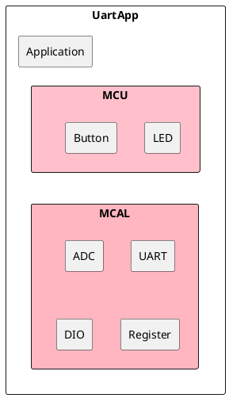
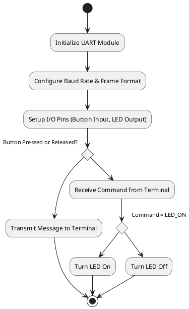

# Detailed Design Document

| **Author**              | `Rokaia Ayman`                                       |
|:------------------------|:-----------------------------------------------------|
| **Status**              | `Draft/Inspection/Approved`                          |
| **Version**             | `1.0`                                                |
| **Date**                | `17/10/2025`                                         |

## Introduction

This document provides a detailed description of how UART was used to perform two main cases in this project. 

In **Case 1**, when a button is pressed or released, a message is transmitted and display on the computer terminal through UART communication (“Button pressed”, “Button released”). 

In **Case 2**, a command is received from the computer terminal by user, which results in a hardware action, if it receives led_on, the LED turns on, and if it receives led_off, the LED is turned off. 

The document also includes the architecture overview of the system, the assumptions and constraints, the functional description,. It also outlines the integration of the files used and the configuration details applied to the hardware and software.

### Purpose
The purpose of this project is to directly communicate with the ATmega328P microcontroller from a computer using the Arduino Uno board. It demonstrates how data can be transmitted and received serially using UART communication protocol through the TX and RX pins on the Arduino board.

Since the project involves both digital input and digital output components, how to combine these operations in pure C language with the UART communication protocol is shown. 

The main aim of completing the project cases is to understand and learn how UART is used in embedded systems, as well as how to receive commands that trigger hardware actions, such as turning on an LED or detecting a button press. 
### Scope
Instead of simplifying the approach on this project and just using Arduino's built-in high-level functions in typical Arduino programming where libraries handel the hardware control. In this project, direct interaction with the ATmega328P registers occurred using pure C code, which allows a clearer understanding of how embedded systems truly work, like how data is transmitted, received, and processed at a hardware level.

By writing low-level code for UART initialization, transmission, and reception, it’s simulated how embedded systems applications are done in the real world. Since this can be run on various microcontrollers, not just Arduino boards, this experience builds engineering skills that can be applied to any system, deepening the understanding of both digital input, digital output, and serial communication in professional embedded design.

## Architectural Overview

Case 1: PD2 is set as an input pin since it’s connected to the button. Then, the internal pull-up resistor is activated, so the pin reads HIGH when the button isn’t pressed and LOW when the button is pressed. The state of PD2 is constantly being checked using the PIND register, so when its state changes, it waits a short time to debounce the button, which sends a message through UART specifying whether the button is pressed or not. 

Case 2: PB0 is set as an output pin since it’s connected to the Led. The system waits for characters that are manually being put through the terminal, using UART. When the character arrives, it gets stored in a buffer until a newline or return is received. Meanwhile, the buffer is getting checked for valid commands like led_on or led_off. If one of these commands is found in the buffer, the Led behaves as the command requests by directly setting or clearing the output pin. If the command isn’t valid, the system sends an error message.

### Assumptions & Constraints

Assumptions:

•The UART communication will always occur at a fixed baud rate of 9600 bps between the Arduino Uno and the computer.

•The microcontroller is powered and running at the defined CPU frequency (F_CPU = 16 MHz) for correct timing and UART operation.

•The serial port is always connected, although occasional lag or delay may occur during communication.

Constraints:

•The button and LED must be connected to the predefined pins (PD2 for the button and PB0 for the LED) for the program to function correctly.

•The software couldn’t be fully tested using Arduino libraries; testing was limited to ensuring the hardware (LED, button, and board) was not damaged.

## Functional Description
This project consists of two modules. The first one reads the state of a push-button connected to a digital pin and sends a message through UART in the terminal containing the state of the button. The second module controls a LED connected to a digital pin based on user input commands which either turns the LED on or off.

## Integration and Configuration
### Static Files

| File name | Contents                             |
|-----------|--------------------------------------|
| main.c | located in src /each folder has it: Has Core logic and flow of code. Case 1, Case 2 and test1...test11 each have their own main.c file.     |
| UART.h     |located in lib/UART folder: Defines functions for sending, receiving, and managing UART serial communication.        |
| UART.c   | located in lib/UART folder: Implements the functions in UART.h for basic UART communication. |

### Configuration

| Name            | Value range       | Description                                           |
|-----------------|-----------------|-------------------------------------------------------|
| F_CPU           | 16,000,000 UL    | CPU clock frequency used for timing calculations     |
| BaudRate        | 9600             | UART communication speed in bits per second          |
| BUTTON_PIN      | PD2              | Digital pin connected to the push-button input       |
| LED_PIN         | PB0              | Digital pin connected to the LED output             |
| DEBOUNCE_DELAY  | 50 ms            | Delay used to debounce the push-button input         |
| UART_BUFFER_SIZE| 10 characters    | Maximum number of characters stored for UART commands|
